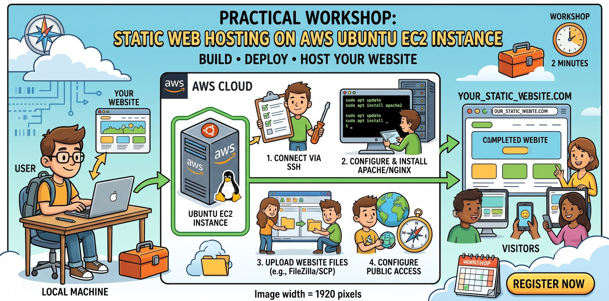
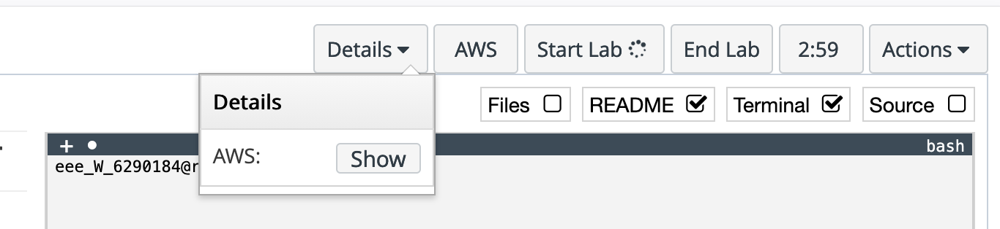
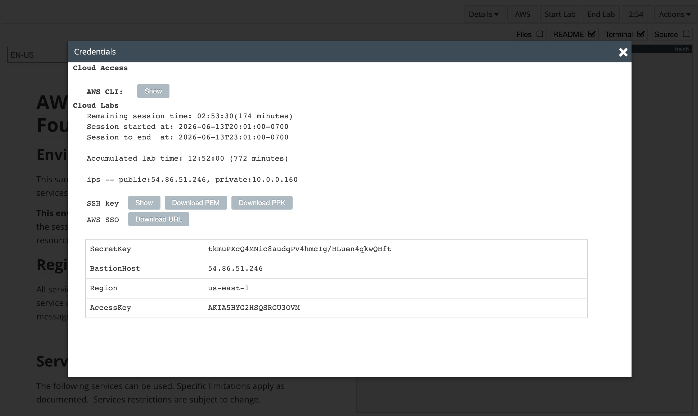

# Web Hosting on AWS EC2



This short tutorial will guide you through the process of hosting a simple website on an AWS EC2 Ubuntu instance.

# Choose Ubuntu image when you create your EC2 instance.

When you create your EC2 instance, make sure you select an Ubuntu image as the commands included in this tutorial are specific to Ubuntu. Amazon Linux and other Linux distributions may have different package managers and commands.

In Ubuntu server, you can use the following command to install nginx web server:

```bash
sudo apt update
sudo apt install nginx -y
```

# Download your SSH Connection Private Key

The following steps only applied to AWS Academy lab. If you are using a production AWS account, you should have downloaded your SSH private key when you created your EC2 instance. Please make sure to keep your private key secure and do not share it with anyone.

In AWS Academy lab or sandbox starting page, do the following steps.

1. Click **Start Lab** button to start your lab/sandbox environment.
   
1. After lab/sandbox successfully loaded, click **Details** and click **Show** button to view you AWS lab environment details. You should see details page like below.
   
1. In the above details page, click **Download PEM** button to download your SSH private key. You will need this private key to connect to your EC2 instance using SSH. The downloaded file will go to your download folder and the file name will be **labsuser.pem**.

# Change the Permissions of Your Private Key (Mac/Linux Only)

This step only applies to Mac and Linux users. If you are using Windows, you can skip this step.

Before you can use your private key to connect to your EC2 instance, you need to change the permissions of the private key file to ensure that it is secure.

You can do this by opening **Terminal** app in your Mac and type the following command.

```bash
chmod 400 /path/to/your/labsuser.pem
```

`chmod` is a linux command that changes the permissions modes of a file. The `400` permission means that only the owner of the file can read it, and no one else can read or write to the file. This is important for security reasons, as it prevents unauthorized access to your private key.

# Establish SSH Connection

Open **Terminal** app (on Mac) or **PowerShell** (on Windows) and use the following command to establish an SSH connection to your EC2 instance.

```bash
ssh -i /path/to/your/labsuser.pem ubuntu@YOUR-EC2-PUBLIC-IP
```

- `ssh` is the command to start an SSH connection.
- `-i` option is used to specify the path to your SSH private key file, which is required for authentication when connecting to your EC2 instance.
- Make sure to replace `/path/to/your/labsuser.pem` with the actual path to your downloaded private key file.
- The `ubuntu` in the command is the default username for Ubuntu EC2 instances. If you are using a different Linux distribution, the default username may be different (e.g., `ec2-user` for Amazon Linux).
- `@` is a symbol to separate the login username from the server IP address. It's a must.
- Make sure to replace `YOUR-EC2-PUBLIC-IP` with the public IP address of your EC2 instance.
- You can find the public IP address of your EC2 instance in the AWS Management Console.

**Your final command for this step should look like below**

```
ssh -i "C:\Users\xxxxxxxx\Downloads\labsuser.pem" ubuntu@11.11.11.11
```

# Using SCP Command to Upload Files/Folder to Your EC2 Instance

`scp` (Secure Copy) is a command-line utility that allows you to securely transfer files and directories between your local machine and a remote server, such as your EC2 instance. You can use the `scp` command to upload files or folders from your local computer to your EC2 instance.

To upload a file to your EC2 instance, use the following command:

**Note:** This step is done in your Windows PowerShell locally, NOT on the Ubuntu prompt.

```bash
scp -i /path/to/your/labsuser.pem -r /local/computer/website/folder/ ubuntu@YOUR-EC2-PUBLIC-IP:~/
```

- `scp` is the command to start a secure copy operation.
- `-i` option is used to specify the path to your SSH private key file,
- `/path/to/your/labsuser.pem` is the path to your SSH private key file.
- `-r` option is used to copy directories recursively. If you are uploading a single file, you can omit this option.
- `/local/computer/website/folder/` is the path to the folder containing your website files/sub-folders on your local machine.
- The `ubuntu` in the command is the default username for Ubuntu EC2 instances. If you are using a different Linux distribution, the default username may be different (e.g., `ec2-user` for Amazon Linux).
- `@` is a symbol to separate the login username from the server IP address. It's a must.
- `YOUR-EC2-PUBLIC-IP` specifies the destination on your EC2 instance where you want to upload the files.
- `:` is a symbol to separate the server IP address from the target directory on the server. It's a must.
- The `~/` symbol specifies the target directory on server your like to copy your files/folders to. Since `ubuntu` user can only write to its home directory, you can specify the destination as `~/`. Later we will need to further move the website files/folders to the web server's root directory.

**Your final command for this step should look like below**

```
scp -i "C:\Users\xxxxxxxx\Downloads\labsuser.pem" -r "C:\Users\xxxxxxxx\Downloads\mywebsite\" ubuntu@11.11.11.11:~/mywebsite
```

# Copy Files & Folders to Web Server's Root Directory

After you have uploaded your website files/folders to your EC2 instance, you need to move or copy them to the web server's root directory so that they can be accessed by web browsers. The web server's root directory is typically located at `/var/www/html` for Ubuntu/nginx installation.

**Notes:** This step is done SSH Ubuntu terminal prompt, NOT on your local computer.

In SSH terminal, make sure you are in the home directory of `ubuntu` user.

```
sudo cp -r ~/your-website-folder/* /var/www/html/
```

- sudo is used to run the command with superuser privileges, which is necessary to write to the web server's root directory.
- The `cp` command is used to copy files and directories.
- The `-r` option is used to copy directories recursively so that files and sub-folders within the specified folder will also be copied.
- `~/your-website-folder/*` specifies the source files/folders you want to copy. where `~` represents the home directory of the current user and `*` means ALL files/folders within the `your-website-folder` will be copied.
- `/var/www/html/` specifies the destination directory on the EC2 instance where the web server serves files from.

**Your final command for this step should look like below**

```
sudo cp -r ~/mywebsite/* /var/www/html/
```
